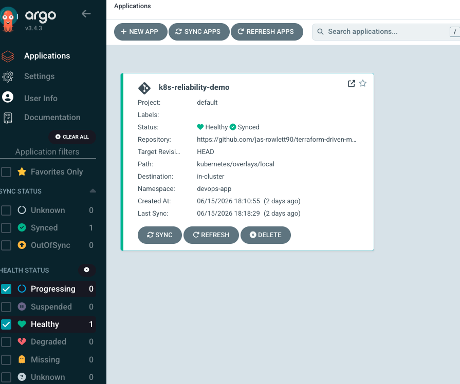
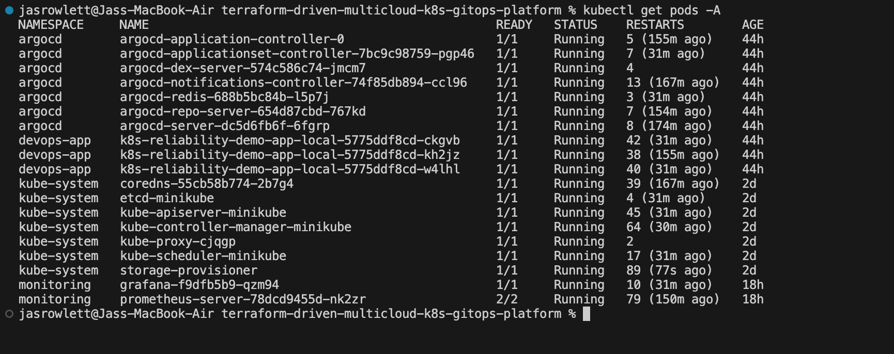
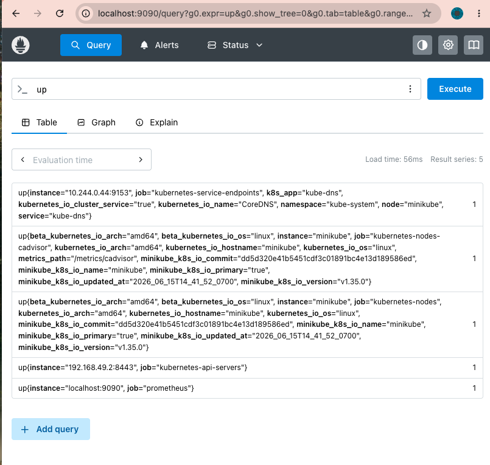
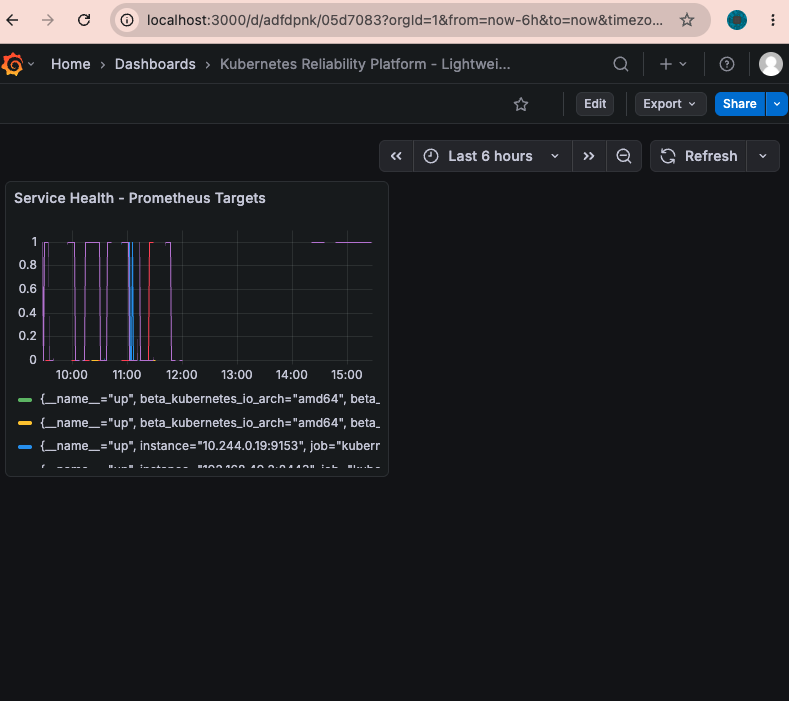
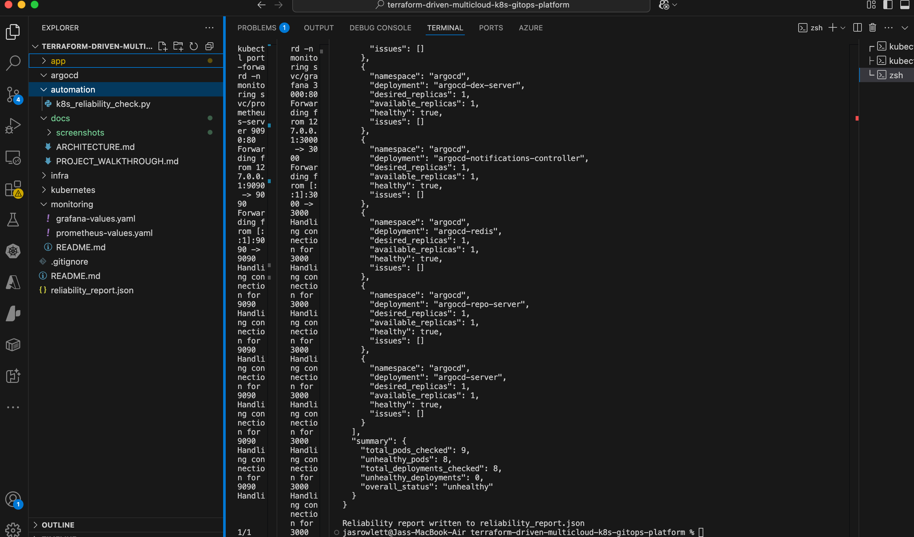

# Terraform-Driven Multi-Cloud Kubernetes Reliability & GitOps Platform

## Overview

This project demonstrates a production-inspired Kubernetes platform built using Infrastructure as Code, GitOps, monitoring, and reliability automation practices.

The platform combines Terraform, Kubernetes, ArgoCD, Prometheus, Grafana, and Python automation to simulate the workflows commonly used by modern platform engineering and DevOps teams.

## Project Goals

* Provision cloud infrastructure using Terraform
* Demonstrate multi-cloud design patterns with AKS and EKS
* Deploy containerized workloads to Kubernetes
* Implement GitOps using ArgoCD
* Monitor workloads using Prometheus and Grafana
* Automate operational health checks using Python
* Create a portfolio-ready project that reflects real-world platform engineering concepts

---

## Technology Stack

| Category                 | Technology         |
| ------------------------ | ------------------ |
| Infrastructure as Code   | Terraform          |
| Cloud Platforms          | Azure AKS, AWS EKS |
| Container Platform       | Kubernetes         |
| Application              | Flask              |
| Containerization         | Docker             |
| Configuration Management | Kustomize          |
| GitOps                   | ArgoCD             |
| Monitoring               | Prometheus         |
| Visualization            | Grafana            |
| Automation               | Python             |
| Version Control          | GitHub             |

---

## Architecture

See:

* docs/ARCHITECTURE.md

### High-Level Flow

GitHub → ArgoCD → Kubernetes

Terraform → AKS / EKS

Prometheus → Metrics Collection

Grafana → Visualization

Python Automation → Reliability Validation

---

## Repository Structure

```text
.
├── app/
├── automation/
├── monitoring/
├── terraform/
│   ├── aks/
│   └── eks/
├── kubernetes/
├── argocd/
├── docs/
│   ├── ARCHITECTURE.md
│   ├── PROJECT_WALKTHROUGH.md
│   └── screenshots/
└── README.md
```

---

## Project Screenshots

### ArgoCD GitOps



ArgoCD continuously reconciles Kubernetes resources with the desired state stored in Git.

---

### Kubernetes Platform Health



Platform services running within Kubernetes, including ArgoCD and monitoring components.

---

### Prometheus Monitoring



Prometheus collecting and querying Kubernetes metrics.

---

### Grafana Visualization



Grafana connected to Prometheus for platform observability.

---

### Reliability Automation



Python automation validates pod and deployment health and generates a structured JSON report.

---

## Key Features

### Infrastructure as Code

* Terraform structure for AKS and EKS
* Repeatable infrastructure provisioning
* Cloud-agnostic deployment concepts

### Kubernetes Operations

* Containerized Flask application
* Kubernetes deployments and services
* Environment customization using Kustomize

### GitOps

* ArgoCD deployment management
* Continuous reconciliation
* Declarative infrastructure workflow

### Observability

* Lightweight Prometheus deployment
* Grafana dashboards
* Metrics-based monitoring

### Reliability Engineering

* Automated Kubernetes health validation
* JSON reporting
* Failure detection via exit codes

---

## Reliability Automation

Location:

automation/k8s_reliability_check.py


Run:


python3 automation/k8s_reliability_check.py


Generated artifact:

reliability_report.json


The script validates:

* Pod health
* Deployment readiness
* Restart counts
* Overall platform status

---

## Monitoring

Prometheus and Grafana are deployed using lightweight Helm installations to support local development environments while still demonstrating observability practices.

Monitoring configuration:

monitoring/
├── prometheus-values.yaml
├── grafana-values.yaml
└── README.md

---

## Project Phases


* Phase 1 – Planning
* Phase 2 – GitHub Structure
* Phase 3 – Flask Application
* Phase 4 – Docker
* Phase 5 – Minikube
* Phase 6 – Kubernetes Deployment
* Phase 7 – Kustomize Overlays
* Phase 8 – Terraform AKS/EKS
* Phase 9 – ArgoCD GitOps
* Phase 10 – Monitoring
* Phase 11 – Python Reliability Automation
* Phase 12 – Documentation

Planned:

* Phase 13 – Cloud Validation (AKS/EKS Execution Testing) will be done in outside branch for perrsonal testing

---

## Lessons Learned

* GitOps simplifies Kubernetes deployment management.
* Kustomize provides reusable environment overlays.
* Observability is critical for platform reliability.
* Infrastructure as Code improves consistency and repeatability.
* Reliability automation can identify issues before they impact workloads.

---

## Author

Built as a hands-on DevOps and Platform Engineering portfolio project focused on Kubernetes, GitOps, monitoring, automation, and infrastructure as code.
